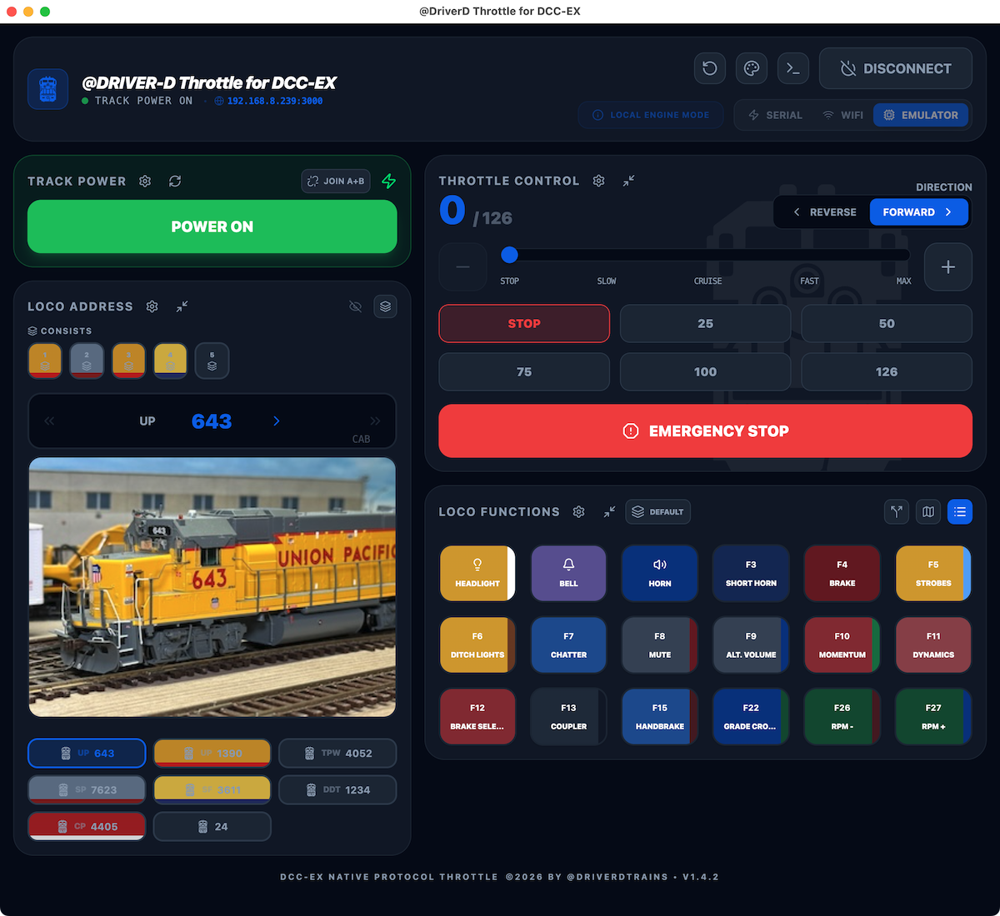

<h1 align="center">Welcome to the @Driver-D Throttle for DCC-EX! All aboard!</h1>

   

<h2> Downloand & Install the @Driver-D Throttle for DCC-EX! </h2>

1. Go to this GitHub repository's releases page by clicking the link below or pressing the 'Releases' button at the right. 
https://github.com/DriverDTrains/DriverD-Throttle-For-DCC-EX/releases  

3. Scroll to the bottom and download the appropriate version for your computer: ZIP file for Windows or DMG file for Mac. 

4. Install the app on your computer:

   <b>Windows:</b> 
   Open the Windows ZIP file, and extract and run the .exe installer. 

   <b>Mac:</b> 
   Open the Mac DMG file and drag the app to your Applications folder or other location. 

5. Set permissions to run the app the first time:

   <b>Windows:</b> 
   Open the app. Windows Defender will display a message that it prevented an unrecognized app from starting. Click ‘More Info’ and then ‘Run Anyway’ to open the app. 

   <b>Mac:</b> 
   Open the app. Mac Gatekeeper will display a message that the app is damaged and cannot be opened. Click 'Cancel'. Open System Settings from the Apple menu, select ‘Privacy & Security’, and scroll down to the bottom to the Security section. Look for a message that the app was blocked and a button to open it anyway. Click the button to open the app. 

   If no message or button, quit System Settings and press Command-Space to open Spotlight, then type ‘Terminal’ and press return to open Terminal. In Terminal type "xattr -c", then drag the icon for the Throttle app into the terminal window. Press Return and quit Terminal. Open the app normally. 

<h2> Open and Run the @Driver-D Throttle for DCC-EX! </h2>

5. Open the app. 
   
6. Choose how you want to connect to the DCC-EX command station and select either the Serial or WiFi button in the upper-right corner of the app window. 

   If connecting via WiFi, enter the DCC-EX command station's IP address and port number (2560) in the boxes provided. (You can usually find this information on the DCC-EX command station's LCD or OLED display.) 

   Click 'Connect' when you are ready to run some trains! 

7. Press the power button to turn on the track power. 

8. Enter a locomotive's DCC address in the Loco Address panel's address box. 

9. Use the Throttle Control speed slider to set your locomotive's speed and roll out! 

<h2> Learn How to Use the @Driver-D Throttle for DCC-EX! </h2>

10. Watch the YouTube video @DriverDTrains #9.d.   https://www.youtube.com/@DriverDTrains

11. Open the Display Settings palette menu in the upper-right corner of the throttle window and take the built-in self-guided Interactive Tour, or open the illustrated User Guide.

12. Run some trains!!  

Happy Railroading! 🚂 

DriverD & Scratchy-C [Meow!] 

   

<i>Created in Google AI Studio by @DriverDTrains (c) 2026.</i>

