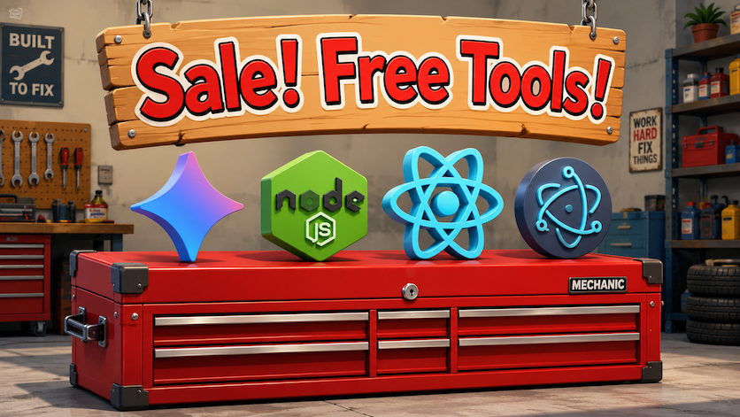
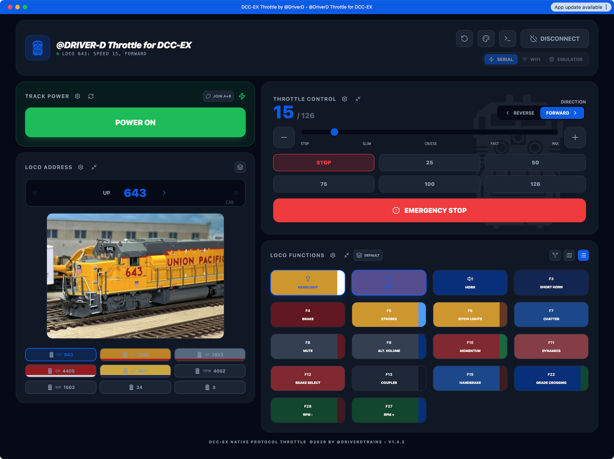

<h1>Tools I used to create the DriverD-Throttle for DCC-EX!</h1>

   

All the tools I used to create the DCC-EX Throttle by @DriverD were free of charge to use. The primary tool I used was Google AI Studio, which I used for free with my Google (Gmail) account.

   <b>Google AI Studio:</b>  https://aistudio.google.com/apps

Occasionally I used ChatGPT to get a second opinion on various technical issues, including strategies for exporting and compiling the code into an app that anyone can use.

Google AI Studio runs in a web browser and doesn’t require any additional software, so it’s very easy to use. For best results we will want to use Google Chrome, or another Chrome-based browser. In particular, Google Chrome can connect to our DCC-EX command station via a serial port, which is the only way to connect to DCC-EX from within AI Studio itself.

After we go to the AI Studio web page, we can click the Apps button to see our prior work, or the “New App” button to start a new app. Google AI Studio includes several different versions of Google’s AI models. When we create an app or select an app to work on, we can select which of Google’s AI models we want to use. When we run out of free credits on one model, we can switch to another.

Once we start vibe coding an app, we will see the chat pane on the left hand side of the window, and the preview pane on the right. The preview pane allows us to run our app right in the browser. We can also place the preview pane into full screen mode.

If we click the ‘Code’ button, a code editor will appear in place of the preview pane, and we can see all the files and code that are part of our app. This is not just a static display. We can add and delete files and folders, upload zip files, and make edits right in the code. This can come in handy as we dive into the weeds of our app.

Google AI Studio incorporates a number of popular open-source web tools and technologies to build its apps. 

   <b>Javascript & Typescript</b> 

Because AI Studio runs in a Chrome web browser, it does its coding primarily in a combination of Javascript and Typescript, which is JavaScript’s pedantic younger cousin. I remember seeing some Javascript in web pages 30 years ago, but the only thing that’s same today is the name. Today’s Javascript is built on a massive scaffolding of libraries and support files that requires almost 9,000 lines of code just to list them all.

   <b>React</b> 

The primary component AI Studio uses to build its apps is the open-source React Javascript library, which is an extremely popular and widely used tool for creating applications and mobile apps that only have one page. 

By the way, Microsoft developed TypeScript, React comes from Facebook parent Meta, and we are putting this all together in Google AI Studio, so almost everybody is riding on this train.

   <b>Node.js</b> 

The last major components to mention are the tools we use to compile and run our app once we export it from AI Studio. While we can run our app within the AI Studio preview pane as much as we want, there may be some features that just don’t work in a web browser, such as making WiFi connections, and eventually we are going to want to export our code so we can run it as a standalone app, and on other devices.

The first tool that we use to do this is called Node.js, which has become one of the commonly used technologies on the web. Node.js is an open-source “runtime” that uses Google’s JavaScript engine to run JavaScript code outside a web browser on various platforms, including Mac and Windows. 

For our purposes, we will use Node.js as a web server to display our app, which we can access from any device that can connect to our computer, including smart phones and tablets.

Using a Node package manager, or npm, we can collect together all the dependencies and tools we need to run our app on our computer. However, we can only run our app this way within the node environment. Further, unless we write a script to do it for us, we need to run Node.js from the command line in the Mac Terminal or Windows Powershell, which is less convenient than simply double-clicking on an app to open it. 

   <b>Electron</b> 

Finally, while Node.js allows us to run our Javascript app outside of a web browser, we still need a web browser to actually connect to our Node.js web server, and interact with our app.

And so the final tool that we will use is another open source framework called Electron, which was designed to create standalone desktop applications using the web technologies we have just discussed. Electron is used for GitHub, WordPress, and Microsoft Visual Studio Code, among others. 

Electron combines our JavaScript app with a Node.js backend web server, and a chrome-based front end web display, to create a standalone app in a single file that we can share and distribute. 

The only one of these tools that you need to install yourself if you want to compile the source code on your computer is Node.js. When you run 'npm', the Node package manager, it will install all the necessary dependencies and pull in Electron to create the standalone app.

Thanks for checking out the DriverD-Throttle for DCC-EX, and happy railroading!🚂 

All aboard! 

DriverD & Scratchy-C [Meow!] 

   

   

<i>Created in Google AI Studio by @DriverDTrains (c) 2026.</i>

